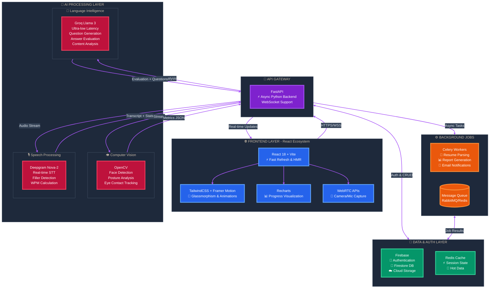

# AI Mock Interview & Career Accelerator

An advanced AI-powered platform designed to bridge the gap between candidate preparation and industry expectations. It offers intelligent resume analysis, real-time mock interviews, and personalized career growth roadmaps.

---

## 🧠 The Problem: Modern Interview Anxiety
Job seekers today face a "Black Box" hiring process:
*   **Resume Uncertainty**: "Is my resume even getting past the ATS?"
*   **Lack of Feedback**: "I was rejected, but I don't know *why*."
*   **Interview Anxiety**: "I freeze up when asked technical questions."
*   **Generic Prep**: "I'm practicing questions that aren't relevant to my specific role."

## 💡 The Solution: Data-Driven Preparation
**Interaura** (Project Name) transforms preparation into a science using three core pillars:
1.  **Smart Resume Analysis**: Decoding the ATS logic.
2.  **AI Mock Interviews**: Real-time simulation with instant, actionable feedback.
3.  **Personalized Growth**: Targeted learning based on performance gaps.

---



### 🗺️ Application Sitemap (Page Connections)

This diagram visualizes the navigation structure between different views in the application.

```mermaid
import React, { useState } from 'react';
import { Home, LogIn, UserPlus, Mail, User, LayoutDashboard, FileText, Dumbbell, BarChart3, Video, Settings, CheckCircle, FileSearch, ArrowRight } from 'lucide-react';

const SitemapNode = ({ icon: Icon, label, description, onClick, isActive, color = "bg-slate-700" }) => (
  <div
    onClick={onClick}
    className={`
      relative flex flex-col items-center p-4 rounded-xl cursor-pointer
      transition-all duration-300 transform hover:scale-105
      ${isActive ? `${color} ring-4 ring-purple-500 shadow-2xl shadow-purple-500/50` : 'bg-slate-800/50 hover:bg-slate-700/70'}
      backdrop-blur-sm border border-slate-600/30
    `}
  >
    <div className={`p-3 rounded-lg ${isActive ? 'bg-white/20' : 'bg-slate-600/30'} mb-2`}>
      <Icon className="w-6 h-6 text-purple-300" />
    </div>
    <span className="text-sm font-semibold text-white text-center">{label}</span>
    {description && (
      <span className="text-xs text-slate-400 text-center mt-1">{description}</span>
    )}
  </div>
);

const ConnectionLine = ({ vertical = false, dashed = false }) => (
  <div className={`
    ${vertical ? 'w-0.5 h-8' : 'h-0.5 w-8'}
    ${dashed ? 'bg-gradient-to-r from-purple-500/0 via-purple-500/50 to-purple-500/0' : 'bg-purple-500/30'}
    ${dashed ? 'animate-pulse' : ''}
  `} />
);

export default function InterauraSitemap() {
  const [activeNode, setActiveNode] = useState('Landing');
  const [showDetails, setShowDetails] = useState(true);

  const nodeDetails = {
    'Landing': {
      route: '/',
      purpose: 'First impression - Hero section with value proposition',
      components: ['Hero Banner', 'Feature Overview', 'CTA Buttons']
    },
    'Login': {
      route: '/login',
      purpose: 'Secure authentication for returning users',
      components: ['Email/Password Form', 'Firebase Auth', 'Remember Me']
    },
    'Register': {
      route: '/register',
      purpose: 'New user account creation',
      components: ['Sign-up Form', 'Password Validation', 'Terms Checkbox']
    },
    'Verification': {
      route: '/verify-email',
      purpose: 'Email confirmation for security',
      components: ['Verification Link', 'Resend Option', 'Status Check']
    },
    'ProfileSetup': {
      route: '/profile/setup',
      purpose: 'Initial user preferences and target role',
      components: ['Role Selection', 'Experience Level', 'Industry Tags']
    },
    'Dashboard': {
      route: '/dashboard',
      purpose: 'Central hub - Activity overview and quick actions',
      components: ['Stats Cards', 'Recent Sessions', 'Quick Start Buttons']
    },
    'ResumeUpload': {
      route: '/resume/upload',
      purpose: 'PDF parsing and ATS scoring',
      components: ['File Uploader', 'Text Extraction', 'Loading States']
    },
    'ResumeInsights': {
      route: '/resume/insights',
      purpose: 'Detailed ATS score breakdown and improvement tips',
      components: ['Score Visualization', 'Keyword Gaps', 'Suggestions']
    },
    'PracticeHub': {
      route: '/practice',
      purpose: 'Question bank and learning resources',
      components: ['Question Library', 'Video Tutorials', 'STAR Method Guide']
    },
    'Analytics': {
      route: '/analytics',
      purpose: 'Historical performance tracking',
      components: ['Progress Charts', 'Comparison Metrics', 'Trend Analysis']
    },
    'InterviewMode': {
      route: '/interview/mode',
      purpose: 'Interview type and difficulty selection',
      components: ['Mode Cards', 'Difficulty Slider', 'Role Context']
    },
    'Setup': {
      route: '/interview/setup',
      purpose: 'Hardware check and pre-interview calibration',
      components: ['Camera Preview', 'Mic Test', 'Permission Requests']
    },
    'ActiveSession': {
      route: '/interview/session',
      purpose: 'Live interview with real-time AI interaction',
      components: ['Video Stream', 'Question Display', 'Timer', 'Transcript']
    },
    'FeedbackResults': {
      route: '/interview/results',
      purpose: 'Comprehensive post-interview analysis',
      components: ['Score Breakdown', 'Video Replay', 'Better Answers']
    }
  };

  return (
    <div className="min-h-screen bg-gradient-to-br from-slate-950 via-slate-900 to-purple-950 p-8">
      <div className="max-w-7xl mx-auto">
        {/* Header */}
        <div className="text-center mb-12">
          <div className="inline-block px-4 py-2 bg-purple-500/20 rounded-full border border-purple-500/30 mb-4">
            <span className="text-purple-300 text-sm font-semibold">✨ INTERAURA</span>
          </div>
          <h1 className="text-4xl font-bold text-white mb-2">Application Sitemap</h1>
          <p className="text-slate-400">Click any node to view route details and components</p>
        </div>

        {/* Sitemap Visualization */}
        <div className="bg-slate-900/50 backdrop-blur-xl rounded-3xl p-8 border border-slate-700/50 mb-8">
          
          {/* Landing */}
          <div className="flex flex-col items-center mb-8">
            <SitemapNode 
              icon={Home} 
              label="Landing Page" 
              description="Entry Point"
              onClick={() => setActiveNode('Landing')}
              isActive={activeNode === 'Landing'}
              color="bg-blue-600/80"
            />
            <ConnectionLine vertical />
          </div>

          {/* Authentication Flow */}
          <div className="bg-slate-800/30 rounded-2xl p-6 mb-8 border border-slate-700/30">
            <div className="text-center mb-4">
              <span className="text-purple-300 font-semibold">🔐 Authentication Flow</span>
            </div>
            <div className="flex justify-center items-start gap-4">
              <SitemapNode 
                icon={LogIn} 
                label="Login" 
                onClick={() => setActiveNode('Login')}
                isActive={activeNode === 'Login'}
              />
              <div className="flex flex-col items-center">
                <SitemapNode 
                  icon={UserPlus} 
                  label="Register" 
                  onClick={() => setActiveNode('Register')}
                  isActive={activeNode === 'Register'}
                />
                <ConnectionLine vertical />
                <ArrowRight className="w-5 h-5 text-purple-400 rotate-90" />
                <ConnectionLine vertical />
                <SitemapNode 
                  icon={Mail} 
                  label="Verification" 
                  description="Email Confirm"
                  onClick={() => setActiveNode('Verification')}
                  isActive={activeNode === 'Verification'}
                />
                <ConnectionLine vertical />
                <ArrowRight className="w-5 h-5 text-purple-400 rotate-90" />
                <ConnectionLine vertical />
                <SitemapNode 
                  icon={User} 
                  label="Profile Setup" 
                  description="Onboarding"
                  onClick={() => setActiveNode('ProfileSetup')}
                  isActive={activeNode === 'ProfileSetup'}
                />
              </div>
            </div>
          </div>

          {/* Dashboard Hub */}
          <div className="flex flex-col items-center mb-6">
            <ConnectionLine vertical dashed />
            <SitemapNode 
              icon={LayoutDashboard} 
              label="Dashboard" 
              description="Command Center"
              onClick={() => setActiveNode('Dashboard')}
              isActive={activeNode === 'Dashboard'}
              color="bg-green-600/80"
            />
            <ConnectionLine vertical />
          </div>

          {/* Main Features Grid */}
          <div className="bg-slate-800/30 rounded-2xl p-6 mb-8 border border-slate-700/30">
            <div className="text-center mb-4">
              <span className="text-purple-300 font-semibold">⚡ Main Features</span>
            </div>
            <div className="grid grid-cols-2 md:grid-cols-4 gap-4 mb-6">
              <SitemapNode 
                icon={FileText} 
                label="Resume Upload" 
                onClick={() => setActiveNode('ResumeUpload')}
                isActive={activeNode === 'ResumeUpload'}
              />
              <SitemapNode 
                icon={Dumbbell} 
                label="Practice Hub" 
                onClick={() => setActiveNode('PracticeHub')}
                isActive={activeNode === 'PracticeHub'}
              />
              <SitemapNode 
                icon={BarChart3} 
                label="Analytics" 
                onClick={() => setActiveNode('Analytics')}
                isActive={activeNode === 'Analytics'}
              />
              <SitemapNode 
                icon={Video} 
                label="Interview Mode" 
                onClick={() => setActiveNode('InterviewMode')}
                isActive={activeNode === 'InterviewMode'}
              />
            </div>

            {/* Resume Flow */}
            <div className="flex justify-start items-center gap-3 mb-6 ml-8">
              <div className="text-xs text-slate-400">Resume Flow:</div>
              <ArrowRight className="w-4 h-4 text-purple-400" />
              <SitemapNode 
                icon={FileSearch} 
                label="Insights" 
                description="ATS Score"
                onClick={() => setActiveNode('ResumeInsights')}
                isActive={activeNode === 'ResumeInsights'}
              />
              <ArrowRight className="w-4 h-4 text-purple-400" />
              <div className="text-xs text-slate-400">Back to Dashboard</div>
            </div>

            {/* Interview Flow */}
            <div className="bg-slate-900/50 rounded-xl p-4 border border-purple-500/20">
              <div className="text-center mb-4">
                <span className="text-purple-300 font-semibold text-sm">🎙️ Interview Flow</span>
              </div>
              <div className="flex justify-center items-center gap-3">
                <SitemapNode 
                  icon={Settings} 
                  label="Setup" 
                  description="A/V Check"
                  onClick={() => setActiveNode('Setup')}
                  isActive={activeNode === 'Setup'}
                />
                <ArrowRight className="w-5 h-5 text-purple-400" />
                <SitemapNode 
                  icon={Video} 
                  label="Active Session" 
                  description="Live Interview"
                  onClick={() => setActiveNode('ActiveSession')}
                  isActive={activeNode === 'ActiveSession'}
                  color="bg-red-600/80"
                />
                <ArrowRight className="w-5 h-5 text-purple-400" />
                <SitemapNode 
                  icon={CheckCircle} 
                  label="Feedback" 
                  description="Results & Tips"
                  onClick={() => setActiveNode('FeedbackResults')}
                  isActive={activeNode === 'FeedbackResults'}
                />
              </div>
            </div>
          </div>
        </div>

        {/* Details Panel */}
        {showDetails && activeNode && nodeDetails[activeNode] && (
          <div className="bg-gradient-to-br from-purple-900/30 to-slate-900/30 backdrop-blur-xl rounded-2xl p-6 border border-purple-500/30">
            <div className="flex items-start justify-between mb-4">
              <div>
                <h3 className="text-2xl font-bold text-white mb-1">{activeNode}</h3>
                <code className="text-sm text-purple-300 bg-slate-800/50 px-2 py-1 rounded">
                  {nodeDetails[activeNode].route}
                </code>
              </div>
              <button 
                onClick={() => setShowDetails(false)}
                className="text-slate-400 hover:text-white transition-colors"
              >
                ✕
              </button>
            </div>
            
            <div className="space-y-4">
              <div>
                <h4 className="text-sm font-semibold text-purple-300 mb-2">Purpose</h4>
                <p className="text-slate-300">{nodeDetails[activeNode].purpose}</p>
              </div>
              
              <div>
                <h4 className="text-sm font-semibold text-purple-300 mb-2">Key Components</h4>
                <div className="flex flex-wrap gap-2">
                  {nodeDetails[activeNode].components.map((comp, idx) => (
                    <span 
                      key={idx}
                      className="px-3 py-1 bg-slate-800/50 text-slate-300 rounded-full text-sm border border-slate-700/30"
                    >
                      {comp}
                    </span>
                  ))}
                </div>
              </div>
            </div>
          </div>
        )}

        {!showDetails && (
          <button
            onClick={() => setShowDetails(true)}
            className="w-full py-3 bg-purple-600/20 hover:bg-purple-600/30 text-purple-300 rounded-xl border border-purple-500/30 transition-colors"
          >
            Show Route Details
          </button>
        )}
      </div>
    </div>
  );
}```

### Flow Breakdown
1.  **Onboarding**: Secure Email/Password auth with verification ensures account security.
2.  **Dashboard**: The central command center showing daily stats, recent scores, and quick actions.
3.  **Resume Parsing**: Users upload a PDF. We extract text, match against role keywords, and generate a **Match Score** leveraging NLP.
4.  **Interview Session**:
    *   **Setup**: Validates hardware permissions.
    *   **Questioning**: The system generates relevant questions (Technical, Behavioral) based on the *uploaded resume* and chosen *job role*.
    *   **Recording**: Captures video (UI) and audio (Analysis).
    *   **Analysis**: 
        *   *Video*: Checked for face position (Attention).
        *   *Audio*: Transcribed via **Deepgram**.
        *   *Content*: Evaluated by **Groq** for relevance, clarity, and structural quality.
5.  **Feedback**: The user receives a comprehensive report card covering **what they said** vs. **how they said it**.

---

## ⚡ Getting Started

1.  **Prerequisites**: Python 3.9+, Node.js 18+, FFMPEG (installed automatically).
2.  **Environment Setup**:
    *   Frontend: `cd frontend && npm install`
    *   Backend: `cd backend && python -m venv venv && source venv/bin/activate && pip install -r requirements.txt`
3.  **API Keys**: Configure `.env` in `backend/` with `GROQ_API_KEY`, `DEEPGRAM_API_KEY`, and `FIREBASE_CREDENTIALS`.
4.  **Launch**:
    *   Backend: `uvicorn backend.main:app --reload`
    *   Frontend: `npm run dev`

---

*Empowering candidates to interview with confidence.*
