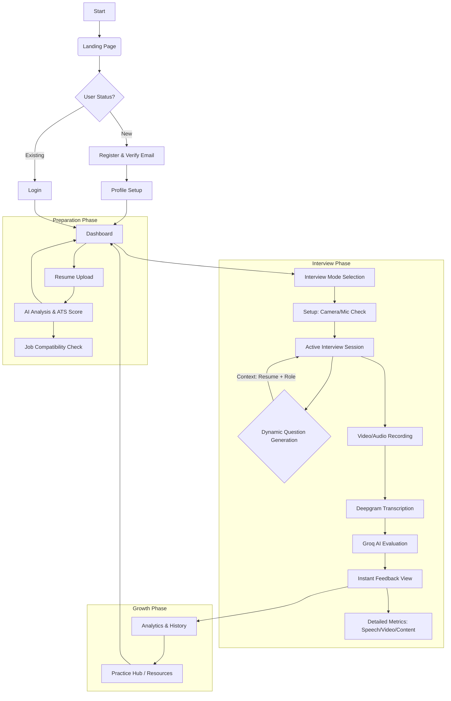
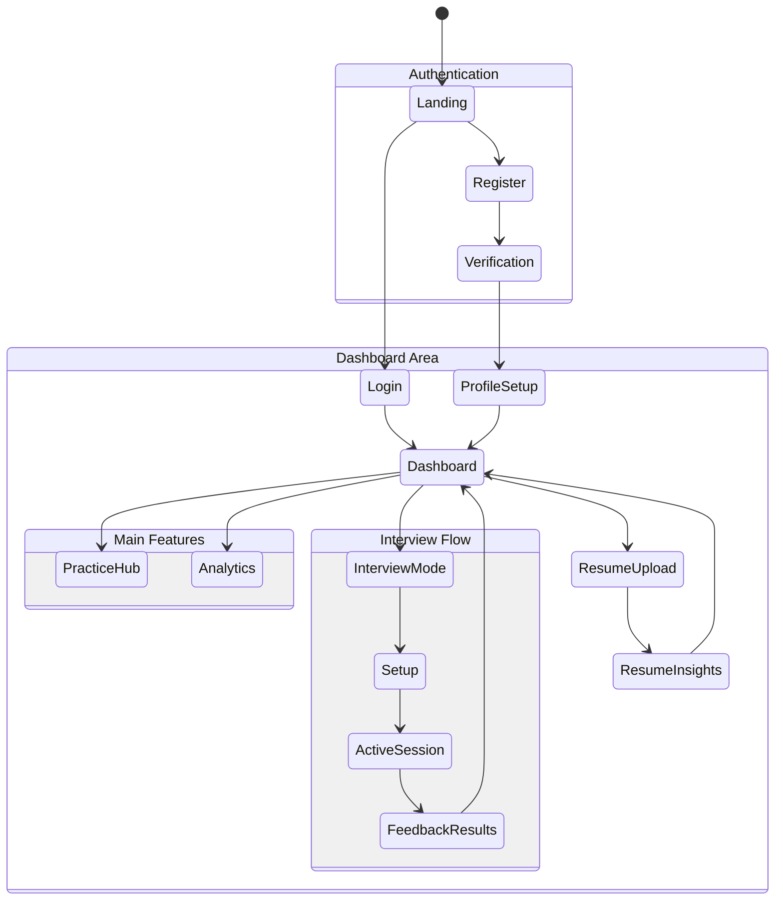

# AI Mock Interview & Career Accelerator

An advanced AI-powered platform designed to bridge the gap between candidate preparation and industry expectations. It offers intelligent resume analysis, real-time mock interviews, and personalized career growth roadmaps.

---

## 🧠 The Problem: Modern Interview Anxiety
Job seekers today face a "Black Box" hiring process:
*   **Resume Uncertainty**: "Is my resume even getting past the ATS?"
*   **Lack of Feedback**: "I was rejected, but I don't know *why*."
*   **Interview Anxiety**: "I freeze up when asked technical questions."
*   **Generic Prep**: "I'm practicing questions that aren't relevant to my specific role."

## 💡 The Solution: Data-Driven Preparation
**Interaura** (Project Name) transforms preparation into a science using three core pillars:
1.  **Smart Resume Analysis**: Decoding the ATS logic.
2.  **AI Mock Interviews**: Real-time simulation with instant, actionable feedback.
3.  **Personalized Growth**: Targeted learning based on performance gaps.

---

```mermaid
%%{init: {'theme': 'base', 'themeVariables': { 'primaryColor': '#0f172a', 'edgeLabelBackground':'#1e293b', 'tertiaryColor': '#334155'}}}%%
graph TD
    User([👤 Job Seeker / Candidate]):::user
    Goal([🏆 Job Readiness & Confidence]):::goal

    subgraph Interaura Platform ["✨ INTERAURA PLATFORM: The Transparent Interview Engine"]
        
        subgraph DashboardHub ["🖥️ Central Dashboard & Auth (React + Firebase)"]
            direction LR
            Profile[Profile Setup] --> DashView[Daily Stats & Quick Actions]
        end

        %% PILLAR 1: RESUME
        subgraph Pillar1 ["📄 PILLAR 1: Smart Resume Analysis"]
            ResumeUpload[PDF Upload] --> Extractor[Text Extraction]
            Extractor --> ATSEngine(ATS Scoring Engine):::ai
            ATSEngine --> JobMatch(Job Compatibility Check):::ai
            
            ATSResult[Output: ATS Score 0-100 & Missing Keywords]:::result
            ATSEngine --> ATSResult
            JobMatch --> ATSResult
        end

        %% PILLAR 2: INTERVIEW
        subgraph Pillar2 ["🎙️ PILLAR 2: Real-time AI Mock Interview"]
            Setup[Mode Selection & A/V Check] --> Session{{Active Interview Session}}:::live
            
            Session -- Video Stream --> VisionAI(OpenCV Vision Analysis):::ai
            Session -- Audio Stream --> SpeechAI(Deepgram Nova-2 STT):::ai
            
            VisionAI -- Posture & Eye Contact Data --> Aggregator
            SpeechAI -- Real-time Transcript (WPM/Fillers) --> Aggregator
            
            Transcript[Transcript Text] --> BrainAI(Groq Llama 3 LLM):::ai
            BrainAI -- "Dynamic Question Generation" --> Session
            BrainAI -- "Content & Context Evaluation" --> Aggregator
        end

        %% PILLAR 3: GROWTH
        subgraph Pillar3 ["📈 PILLAR 3: Personalized Growth"]
            Aggregator{Multi-Modal Data Aggregator} --> ReportCard[Detailed Feedback Report]:::result
            
            ReportCard -- "Behavioral Metrics (Confidence, Pace)" --> Analytics[Historical Analytics View]
            ReportCard -- "Better Answer Suggestions" --> Practice[Practice Hub & Resources]
        end

    end

    %% Main User Flows
    User ==> |"1. Registers & Connects"| DashboardHub
    DashView ==> |"2. Analyzes Resume"| Pillar1
    ATSResult -.-> |"Informs Questions"| Pillar2
    DashView ==> |"3. Starts Practice"| Pillar2
    Pillar2 ==> |"4. Reviews Performance"| Pillar3
    Pillar3 ==> |"5. Tracks Progress over Time"| Goal

    %% Backend Connections
    subgraph BackendServices ["🧠 The AI 'Brain' & Backend (FastAPI)"]
        ATSEngine
        JobMatch
        VisionAI
        SpeechAI
        BrainAI
    end

    %% Styling
    classDef user fill:#2563eb,stroke:#60a5fa,color:white,font-weight:bold;
    classDef goal fill:#059669,stroke:#34d399,color:white,font-weight:bold;
    classDef ai fill:#7e22ce,stroke:#a855f7,color:white,shape:hexagon;
    classDef live fill:#be123c,stroke:#f43f5e,color:white,shape:diamond;
    classDef result fill:#1e293b,stroke:#94a3b8,color:#bfdbfe,stroke-dasharray: 5 5;

    linkStyle 6,7,8,9,10,11,12,13,14 stroke:#a855f7,stroke-width:2px,color:#e2e8f0;
```


## 🚀 Key Features & Benefits

| Problem Area | Our Feature | User Benefit |
| :--- | :--- | :--- |
| **"Will I get noticed?"** | **ATS Scorer & Resume Insights** | Instantly seeing an ATS score (0-100), missing keywords, and role fit probabilities. |
| **"I'm nervous."** | **Real-time AI Interview** | Practice in a safe, judgment-free environment with realistic questions tailored to your resume. |
| **"How did I do?"** | **Detailed Behavioral & Speech Analysis** | Get granular feedback on **Eye Contact**, **Posture**, **Filler Words**, **WPM** (Pacing), and **Confidence**. |
| **"What should I say?"** | **Content Suggestions** | The AI doesn't just grade you—it suggests *better answers* with specific context and examples. |
| **"Am I ready?"** | **Job Compatibility Check** | Understand exactly how well your skills match a specific job description before applying. |

---

## 🛠️ Technical Architecture

### Frontend (User Experience)
*   **React + Vite**: Blazing fast, responsive UI.
*   **TailwindCSS + Framer Motion**:  Glassmorphism aesthetics with smooth, premium animations using a "Galaxy/Future" theme.
*   **Recharts**: Visualizing progress with dynamic charts.

### Backend (The Brain)
*   **FastAPI**: High-performance Python backend.
*   **Deepgram Nova-2**: Industry-leading Speech-to-Text (STT) for near-instant transcription.
*   **Groq (Llama 3)**: Ultra-low latency LLM for human-like conversation analysis and dynamic questioning.
*   **Firebase**: Secure authentication and real-time database.
*   **OpenCV**: Computer vision analysis for posture and eye contact tracking.

---

## 🔄 Project Logic & Flow

The user journey is designed to mirror the actual recruitment funnel, but with transparency:



### 🗺️ Application Sitemap (Page Connections)

This diagram visualizes the navigation structure between different views in the application.



### Flow Breakdown
1.  **Onboarding**: Secure Email/Password auth with verification ensures account security.
2.  **Dashboard**: The central command center showing daily stats, recent scores, and quick actions.
3.  **Resume Parsing**: Users upload a PDF. We extract text, match against role keywords, and generate a **Match Score** leveraging NLP.
4.  **Interview Session**:
    *   **Setup**: Validates hardware permissions.
    *   **Questioning**: The system generates relevant questions (Technical, Behavioral) based on the *uploaded resume* and chosen *job role*.
    *   **Recording**: Captures video (UI) and audio (Analysis).
    *   **Analysis**: 
        *   *Video*: Checked for face position (Attention).
        *   *Audio*: Transcribed via **Deepgram**.
        *   *Content*: Evaluated by **Groq** for relevance, clarity, and structural quality.
5.  **Feedback**: The user receives a comprehensive report card covering **what they said** vs. **how they said it**.

---

## ⚡ Getting Started

1.  **Prerequisites**: Python 3.9+, Node.js 18+, FFMPEG (installed automatically).
2.  **Environment Setup**:
    *   Frontend: `cd frontend && npm install`
    *   Backend: `cd backend && python -m venv venv && source venv/bin/activate && pip install -r requirements.txt`
3.  **API Keys**: Configure `.env` in `backend/` with `GROQ_API_KEY`, `DEEPGRAM_API_KEY`, and `FIREBASE_CREDENTIALS`.
4.  **Launch**:
    *   Backend: `uvicorn backend.main:app --reload`
    *   Frontend: `npm run dev`

---

*Empowering candidates to interview with confidence.*
