# AI Mock Interview & Career Accelerator

An advanced AI-powered platform designed to bridge the gap between candidate preparation and industry expectations. It offers intelligent resume analysis, real-time mock interviews, and personalized career growth roadmaps.

---

## 🧠 The Problem: Modern Interview Anxiety
Job seekers today face a "Black Box" hiring process:
*   **Resume Uncertainty**: "Is my resume even getting past the ATS?"
*   **Lack of Feedback**: "I was rejected, but I don't know *why*."
*   **Interview Anxiety**: "I freeze up when asked technical questions."
*   **Generic Prep**: "I'm practicing questions that aren't relevant to my specific role."

## 💡 The Solution: Data-Driven Preparation
**Interaura** (Project Name) transforms preparation into a science using three core pillars:
1.  **Smart Resume Analysis**: Decoding the ATS logic.
2.  **AI Mock Interviews**: Real-time simulation with instant, actionable feedback.
3.  **Personalized Growth**: Targeted learning based on performance gaps.

---

```mermaid
%%{init: {'theme': 'base', 'themeVariables': { 'primaryColor': '#0f172a', 'primaryTextColor': '#e2e8f0', 'primaryBorderColor': '#7e22ce', 'lineColor': '#a855f7', 'secondaryColor': '#1e293b', 'tertiaryColor': '#334155', 'background': '#020617', 'mainBkg': '#0f172a', 'secondBkg': '#1e293b', 'edgeLabelBackground':'#334155', 'clusterBkg': '#1e293b', 'clusterBorder': '#475569', 'fontSize': '14px'}}}%%

graph TB
    subgraph Client ["🌐 FRONTEND LAYER - React Ecosystem"]
        direction TB
        UI[React 18 + Vite<br/>⚡ Fast Refresh & HMR]
        Style[TailwindCSS + Framer Motion<br/>🎨 Glassmorphism & Animations]
        Charts[Recharts<br/>📊 Progress Visualization]
        WebRTC[WebRTC APIs<br/>🎥 Camera/Mic Capture]
        
        UI --> Style
        UI --> Charts
        UI --> WebRTC
    end

    subgraph Gateway ["🚪 API GATEWAY"]
        FastAPI[FastAPI<br/>⚡ Async Python Backend<br/>WebSocket Support]
    end

    subgraph AIServices ["🤖 AI PROCESSING LAYER"]
        direction LR
        
        subgraph Vision ["👁️ Computer Vision"]
            OpenCV[OpenCV<br/>Face Detection<br/>Posture Analysis<br/>Eye Contact Tracking]
        end
        
        subgraph Speech ["🎙️ Speech Processing"]
            Deepgram[Deepgram Nova-2<br/>Real-time STT<br/>Filler Detection<br/>WPM Calculation]
        end
        
        subgraph Intelligence ["🧠 Language Intelligence"]
            Groq[Groq Llama 3<br/>Ultra-low Latency<br/>Question Generation<br/>Answer Evaluation<br/>Content Analysis]
        end
    end

    subgraph DataLayer ["💾 DATA & AUTH LAYER"]
        direction TB
        Firebase[Firebase<br/>🔐 Authentication<br/>📁 Firestore DB<br/>☁️ Cloud Storage]
        Cache[Redis Cache<br/>⚡ Session State<br/>🎯 Hot Data]
    end

    subgraph Processing ["⚙️ BACKGROUND JOBS"]
        Celery[Celery Workers<br/>📄 Resume Parsing<br/>📊 Report Generation<br/>📧 Email Notifications]
        Queue[(Message Queue<br/>RabbitMQ/Redis)]
    end

    %% Data Flow Connections
    Client -->|HTTPS/WSS| Gateway
    Gateway -->|Video Stream| Vision
    Gateway -->|Audio Stream| Speech
    Gateway -->|Text Analysis| Intelligence
    
    Vision -->|Metrics JSON| Gateway
    Speech -->|Transcript + Stats| Gateway
    Intelligence -->|Evaluation + Questions| Gateway
    
    Gateway <-->|Auth & CRUD| DataLayer
    Gateway -->|Async Tasks| Processing
    Processing <-->|Job Results| DataLayer
    
    Gateway -->|Real-time Updates| Client

    %% Styling
    classDef frontend fill:#2563eb,stroke:#60a5fa,color:#fff,stroke-width:3px
    classDef backend fill:#7e22ce,stroke:#a855f7,color:#fff,stroke-width:3px
    classDef ai fill:#be123c,stroke:#f43f5e,color:#fff,stroke-width:3px
    classDef data fill:#059669,stroke:#34d399,color:#fff,stroke-width:3px
    classDef process fill:#ea580c,stroke:#fb923c,color:#fff,stroke-width:3px

    class UI,Style,Charts,WebRTC frontend
    class FastAPI backend
    class OpenCV,Deepgram,Groq ai
    class Firebase,Cache data
    class Celery,Queue process

    linkStyle default stroke:#a855f7,stroke-width:2px
```

### 🗺️ Application Sitemap (Page Connections)

This diagram visualizes the navigation structure between different views in the application.

### Flow Breakdown
1.  **Onboarding**: Secure Email/Password auth with verification ensures account security.
2.  **Dashboard**: The central command center showing daily stats, recent scores, and quick actions.
3.  **Resume Parsing**: Users upload a PDF. We extract text, match against role keywords, and generate a **Match Score** leveraging NLP.
4.  **Interview Session**:
    *   **Setup**: Validates hardware permissions.
    *   **Questioning**: The system generates relevant questions (Technical, Behavioral) based on the *uploaded resume* and chosen *job role*.
    *   **Recording**: Captures video (UI) and audio (Analysis).
    *   **Analysis**: 
        *   *Video*: Checked for face position (Attention).
        *   *Audio*: Transcribed via **Deepgram**.
        *   *Content*: Evaluated by **Groq** for relevance, clarity, and structural quality.
5.  **Feedback**: The user receives a comprehensive report card covering **what they said** vs. **how they said it**.

---

## ⚡ Getting Started

1.  **Prerequisites**: Python 3.9+, Node.js 18+, FFMPEG (installed automatically).
2.  **Environment Setup**:
    *   Frontend: `cd frontend && npm install`
    *   Backend: `cd backend && python -m venv venv && source venv/bin/activate && pip install -r requirements.txt`
3.  **API Keys**: Configure `.env` in `backend/` with `GROQ_API_KEY`, `DEEPGRAM_API_KEY`, and `FIREBASE_CREDENTIALS`.
4.  **Launch**:
    *   Backend: `uvicorn backend.main:app --reload`
    *   Frontend: `npm run dev`

---

*Empowering candidates to interview with confidence.*
